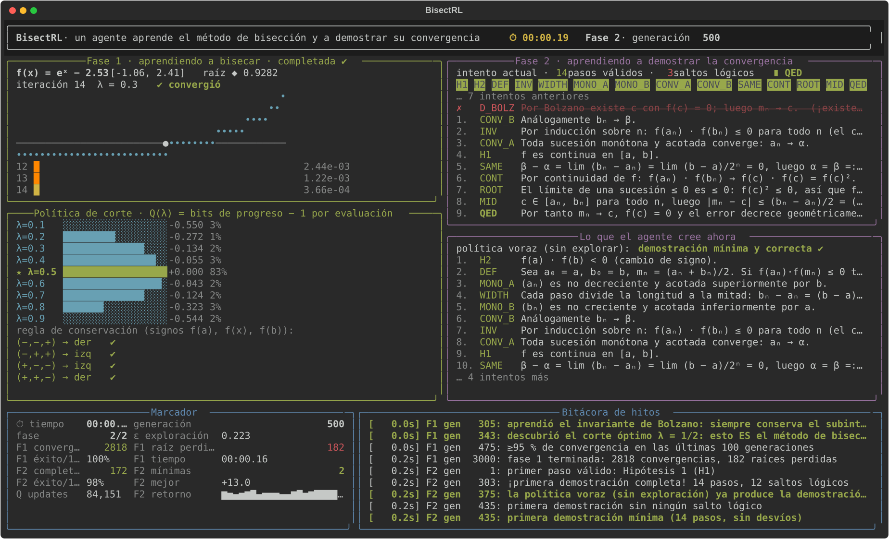

# BisectRL

**Un agente de Reinforcement Learning aprende, en vivo en tu terminal, el método de bisección y a demostrar su convergencia.**

Al estilo de los vídeos de *AI Warehouse*: se ve generación a generación cómo un agente que empieza cortando intervalos al azar y escribiendo demostraciones sin sentido termina redescubriendo el punto medio, el invariante de Bolzano y el orden lógico de la demostración. Con cronómetro, marcador, bitácora de hitos y, al final, una síntesis en prosa de *cómo* aprendió.

```
python -m bisectrl
```



## Qué aprende el agente

Nada del método ni de la demostración está programado como regla. Solo hay recompensas y un verificador de dependencias.

### Fase 1 · aprender a bisecar

Entorno: una función continua aleatoria (polinomios, senos, exponenciales…) en un intervalo `[a, b]` con `f(a)·f(b) < 0`. En cada iteración el agente decide, sin conocer el algoritmo:

1. **dónde cortar**: una fracción `λ ∈ {0.1, …, 0.9}`, y se evalúa `f` en `x = a + λ(b − a)`;
2. **qué lado conservar**: `[a, x]` o `[x, b]`.

Recompensa por iteración: `−1 + log₂(longitud anterior / longitud nueva)` (*shaping* basado en potencial, que no altera la política óptima), `−10` y fin del episodio si el subintervalo conservado pierde el cambio de signo (rompe la hipótesis de Bolzano), y el episodio termina cuando la longitud baja de la tolerancia.

Lo que emerge es exactamente el método de bisección:

* la **cabeza de corte** (un bandido de 9 brazos con promedio muestral y bono de curiosidad UCB) descubre que `λ = 1/2` maximiza el progreso esperado por evaluación: `Q(0.5) = 0`, `Q(0.4) = Q(0.6) ≈ −0.03`, `Q(0.1) ≈ −0.55` bits;
* la **cabeza de conservación** (tabla Q sobre los signos de `f(a), f(x), f(b)`) aprende a conservar siempre el lado con cambio de signo: el invariante `f(aₙ)·f(bₙ) ≤ 0` de la demostración.

### Fase 2 · aprender a demostrar la convergencia

**Teorema.** Sea `f` continua en `[a, b]` con `f(a)·f(b) < 0`. Las sucesiones `aₙ, bₙ, mₙ = (aₙ + bₙ)/2` de la bisección satisfacen `mₙ → c` con `f(c) = 0` y `|mₙ − c| ≤ (b − a)/2ⁿ⁺¹`.

La demostración se modela como un grafo de dependencias de 14 pasos (hipótesis, definición, invariante, longitud, monotonía, convergencia de cada sucesión, mismo límite, continuidad, raíz, cota de error, ∎) más 7 **distractores**: lemas falsos, irrelevantes o de otro método (Newton, derivadas, Lipschitz, unicidad…), incluido el *non sequitur* clásico «por Bolzano existe una raíz, luego el método converge a ella».

* Estado: conjunto de pasos ya establecidos (máscara de bits).
* Acción: el siguiente paso a afirmar.
* Recompensa: `−0.5` por línea válida (cada línea cuesta), `−2` por **salto lógico** (dependencias sin establecer, repetición o distractor), `+20` al llegar a ∎.

Un Q-learning tabular (ε-greedy + bono UCB) descubre un orden topológico válido del grafo y aprende a rechazar los distractores. Los pasos se asientan en la política en orden de profundidad: primero las hipótesis, luego definición y lemas básicos, y la conclusión al final, porque su valor solo se propaga hacia atrás una vez recorrida la cadena completa.

## Interfaz en vivo

| panel | qué muestra |
|---|---|
| **Fase 1** | la función, la raíz ◆, el punto evaluado ● y el intervalo actual (banda amarilla); debajo, las últimas iteraciones como barras que se encogen |
| **Política de corte** | `Q(λ)` de cada fracción (★ = la mejor), % de uso reciente y la regla de conservación aprendida con ✔/✘ |
| **Fase 2** | el intento de demostración en curso: pasos válidos en verde, saltos lógicos tachados en rojo, y el grafo de dependencias que se va iluminando |
| **Lo que el agente cree ahora** | la demostración que produce la política voraz (sin exploración) en este momento |
| **Marcador** | cronómetro, generación, ε, convergencias, raíces perdidas, demostraciones completas y mínimas |
| **Bitácora** | hitos con su tiempo y generación («descubrió λ = 1/2», «primera demostración sin saltos lógicos»…) |

Al terminar imprime y guarda en `runs/<fecha>/`:

* `informe.md`: síntesis en prosa de cómo aprendió, la demostración final, la política de corte, el orden en que se asentó cada paso, los saltos lógicos más frecuentes y la bitácora;
* `demostracion.md`: solo la demostración final;
* `historia.json`: curvas y tablas para analizarlas o graficarlas.

## Instalación y uso

```bash
git clone https://github.com/<tu-usuario>/BisectRL.git
cd BisectRL
python -m venv .venv && source .venv/bin/activate   # o: uv venv && source .venv/bin/activate
pip install -e ".[dev]"                              # o: uv pip install -e ".[dev]"

python -m bisectrl                 # ~1–2 min con animación
python -m bisectrl --speed 3       # más rápido
python -m bisectrl --fast          # sin pausas
python -m bisectrl --no-tui        # solo entrena y escribe el informe
python -m bisectrl --seed 7 --episodes1 5000 --episodes2 4000 --tol 1e-4
pytest -q
```

Requiere Python ≥ 3.10 y una terminal de al menos 120 × 40 (Unicode). Para grabar un vídeo como los de YouTube: `asciinema rec` o [vhs](https://github.com/charmbracelet/vhs).

## Estructura

```
bisectrl/
  proof_kb.py       base de conocimiento: pasos, dependencias y distractores
  env_bisection.py  entorno de la fase 1 (funciones aleatorias, recompensa con shaping)
  env_proof.py      entorno de la fase 2 (verificador de dependencias)
  agent.py          Q-learning tabular con ε-greedy, tasa 1/N opcional y bono UCB
  trainer.py        bucle de entrenamiento, métricas e hitos
  tui.py            interfaz en vivo (rich)
  report.py         informe en Markdown, síntesis en prosa e historia JSON
  cli.py            línea de comandos
tests/              entornos, verificador y un entrenamiento corto de extremo a extremo
```

## Referencias

* Ng, Harada y Russell (1999). *Policy invariance under reward transformations: theory and application to reward shaping.* ICML.
* Sutton y Barto (2018). *Reinforcement Learning: An Introduction*, 2.ª ed.
* Burden y Faires. *Análisis numérico*, cap. 2 (método de bisección).

## Licencia

MIT.
