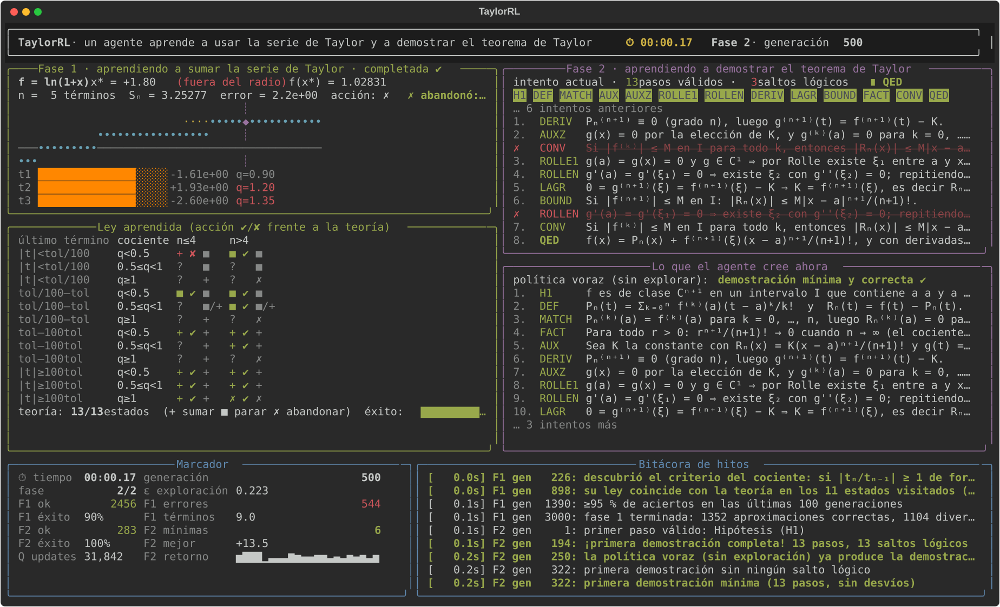

# 03 · TaylorRL — series de Taylor

**Un agente de Reinforcement Learning aprende, en vivo en la terminal, a usar la serie de Taylor como método numérico (cuántos términos sumar, cuándo parar, cuándo la serie no sirve) y a demostrar el teorema de Taylor con resto de Lagrange.**

Tercer proyecto de la serie [rl_metodos](../README.md), intermedio entre [02 · punto fijo](../02_punto_fijo/) y 04 · Newton: el resto de Lagrange que se demuestra aquí es la herramienta con la que Newton probará su convergencia cuadrática.

```
python -m taylorrl
```



## Qué aprende el agente

### Fase 1 · sumar la serie con criterio

Objetivo: calcular `f(x*)` con la serie de Taylor en 0 usando el menor número de términos, con tolerancia `10⁻⁶`. Las funciones son `eˣ, sin, cos, ln(1+x), 1/(1−x), arctan, √(1+x), 1/(1+x²)` y el punto `x*` cae unas veces dentro y otras fuera del radio de convergencia. El agente **no conoce `f` ni su radio**. Solo observa, tras cada término:

* el tamaño del último término frente a la tolerancia, `log₁₀(|tₙ|/tol)`, en 4 cubos;
* el cociente entre términos consecutivos `q = |tₙ/tₙ₋₁|`, en 3 cubos (lo que mira el criterio de d'Alembert);
* si lleva pocos (`n ≤ 4`) o muchos términos.

Acciones: **sumar** el siguiente término (`−1 + log₁₀(error anterior/error nuevo)`, shaping basado en el error real que el entorno conoce y el agente no ve), **parar** y entregar la suma (`+10` si el error es menor que la tolerancia, `−10` si no), o **abandonar** declarando que la serie no converge (`+10` si `|x*|` supera el radio, `−10` si no).

Lo que emerge, y coincide con la teoría en todos los estados bien visitados:

| observación | ley aprendida | teoría detrás |
|---|---|---|
| `q ≥ 1` sostenido (n > 4) | abandonar | criterio del cociente: la serie no converge en `x*` |
| `q ≥ 1` al principio (n ≤ 4) | seguir sumando | `eˣ` en `x = 2.5` crece unos términos y luego converge |
| `\|tₙ\| < tol/100`, `q < 1` | parar | la cola es ≈ `\|tₙ\|·q/(1−q) < tol` |
| `tol/100 ≤ \|tₙ\| < tol`, `q < 0.5` | parar | idem |
| `\|tₙ\| ≥ tol` | sumar | el error aún supera la tolerancia |

Sumar sin criterio nunca acierta (agota los 60 términos o desborda); el agente acierta en ~90–95 % de los casos con ~9 términos de media.

### Fase 2 · demostrar el teorema de Taylor

**Teorema.** Sea `f ∈ Cⁿ⁺¹` en un intervalo que contiene a `a` y `x`. Existe `ξ` entre `a` y `x` con
`f(x) = Σₖ₌₀ⁿ f⁽ᵏ⁾(a)(x−a)ᵏ/k! + f⁽ⁿ⁺¹⁾(ξ)(x−a)ⁿ⁺¹/(n+1)!`. Si además `|f⁽ᵏ⁾| ≤ M` para todo `k`, la serie de Taylor converge a `f(x)`.

Grafo de 13 pasos (hipótesis, polinomio y resto, derivadas que coinciden en `a`, función auxiliar, sus ceros, Rolle, Rolle iterado n+1 veces, derivada (n+1)-ésima, resto de Lagrange, cota, lema del factorial, convergencia, ∎) más 7 **distractores** con errores clásicos: «`f ∈ C^∞` luego su serie converge a `f`» (falso: `e^{−1/x²}`), «los términos tienden a 0 luego la serie converge» (falso: armónica), «por el teorema del valor medio `Rₙ → 0`» (non sequitur: el TVM es el caso `n = 0`), «toda serie converge en todo ℝ», Bolzano, Newton y L'Hôpital.

## Interfaz en vivo

| panel | qué muestra |
|---|---|
| **Fase 1** | `f` (cian) frente a la suma parcial `Pₙ` (amarillo) en el dominio, con `x*` y `f(x*)` marcados ◆; debajo, los últimos términos en escala log con su cociente `q` (en rojo si `≥ 1`) |
| **Ley aprendida** | los 24 estados con la acción aprendida y ✔/✘ frente a la teoría, separados por `n ≤ 4` / `n > 4` |
| **Fase 2 / Lo que el agente cree ahora** | el intento de demostración en curso y la demostración de la política voraz |
| **Marcador / Bitácora** | cronómetro, generación, ε, aciertos, errores, demostraciones e hitos |

Al terminar guarda `informe.md`, `demostracion.md` e `historia.json` en `runs/<fecha>/`.

## Uso

```bash
cd 03_taylor
python -m venv .venv && source .venv/bin/activate
pip install -e ".[dev]"
python -m taylorrl              # ~1–2 min con animación
python -m taylorrl --speed 3
python -m taylorrl --no-tui
pytest -q
```

## Referencias

* Burden y Faires. *Análisis numérico*, §1.1 (polinomios de Taylor).
* Apostol. *Calculus*, vol. 1, cap. 7 (aproximación polinómica, resto de Lagrange).
