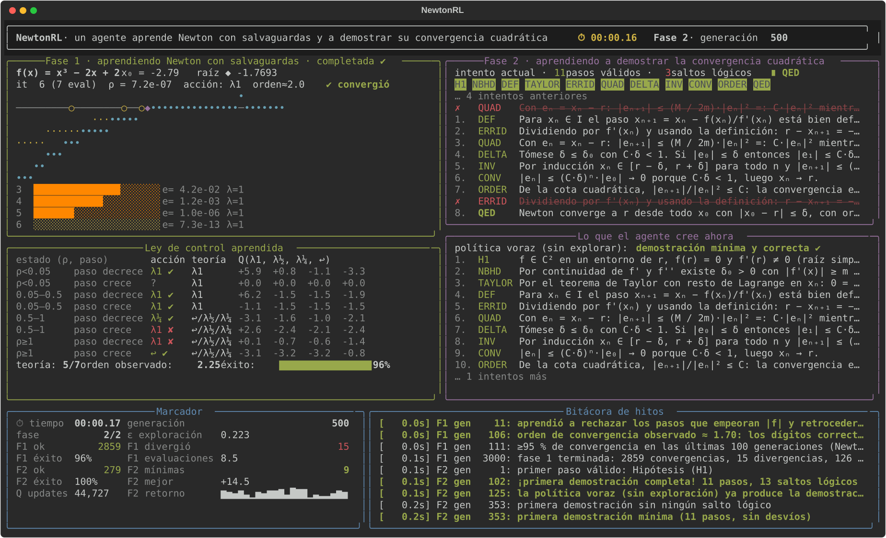

# 04 · NewtonRL — método de Newton–Raphson

**Un agente de Reinforcement Learning aprende, en vivo en la terminal, cuándo es seguro dar el paso completo de Newton y cuándo amortiguarlo o retroceder, y demuestra la convergencia cuadrática local del método.**

Cuarto proyecto de la serie [rl_metodos](../README.md). Cierra el arco: el paso de Newton es el punto fijo óptimo del [proyecto 02](../02_punto_fijo/) (α = 1/f'), y su demostración usa el resto de Lagrange del [proyecto 03](../03_taylor/).

```
python -m newtonrl
```



## Qué aprende el agente

### Fase 1 · Newton con salvaguardas

El paso `d = −f(x)/f'(x)` se conoce. Lo que el agente no sabe es **cuándo es seguro darlo entero**. El banco de problemas está lleno de trampas clásicas:

| función | qué le pasa a Newton puro |
|---|---|
| `arctan x` desde `\|x₀\| > 1.39` | diverge: cada paso se aleja más |
| `∛x` | diverge desde **cualquier** `x₀`: `xₙ₊₁ = −2xₙ` (f' infinita en la raíz: viola la hipótesis f ∈ C²) |
| `ln x − 1` desde `x₀ > e²` | el paso cae en `x ≤ 0`, fuera del dominio |
| `x·e^{−x²}` desde `\|x₀\| ≈ 0.5` | cicla o se pasa al otro lado |
| `eˣ − c` desde la izquierda | el primer paso se pasa de largo enormemente |
| cúbicas y `x³ − 2x + 2` desde la izquierda | convergencia monótona y cuadrática (para ver los dígitos duplicarse) |

Newton puro converge en ~73 % de los casos. El agente observa solo `ρ = |f(xₙ)|/|f(xₙ₋₁)|` (4 cubos) y si el paso de Newton propuesto crece o decrece, y elige: paso completo, `λ = ½`, `λ = ¼`, o **retroceder** con una búsqueda lineal (volver al punto anterior y reducir λ hasta que `|f|` baje; cada evaluación cuesta 1). Recompensa: `−1` por evaluación `+ log₁₀` de la reducción del **error real** `|x − r|` (shaping basado en potencial; el entorno conoce la raíz, el agente no la ve, y así no se premia "converger" a `f → 0` en el infinito), `−10` si diverge, fin cuando `|x − r| < 10⁻⁹`.

Lo que emerge es **Newton amortiguado con backtracking**, comparado con la regla de Armijo (c = ½):

* residuo cayendo rápido → paso completo: cuenca de convergencia cuadrática, y el **orden observado ≈ 2** (los dígitos correctos se duplican);
* el paso empeoró `|f|` y el siguiente propuesto crece → retroceder con búsqueda lineal;
* y un matiz que Armijo no contempla y el agente descubre solo: si el paso propuesto ya decrece, el paso completo es más barato que la búsqueda lineal.

El agente converge en ~93–96 % de los casos con ~9 evaluaciones de media. El informe marca con «✘ (matiz)» los estados donde discrepa de Armijo y explica por qué.

### Fase 2 · demostrar la convergencia cuadrática

**Teorema.** Sea `f ∈ C²` en un entorno de `r` con `f(r) = 0` y `f'(r) ≠ 0`. Existe `δ > 0` tal que para todo `|x₀ − r| ≤ δ` la sucesión de Newton converge a `r` y `|xₙ₊₁ − r| ≤ (M/2m)·|xₙ − r|²`, con `m = min|f'|`, `M = max|f''|`.

Grafo de 11 pasos (hipótesis, entorno seguro con `f' ≠ 0`, definición, Taylor con resto de Lagrange con `n = 1`, identidad del error, cota cuadrática, elección de δ, invariante, convergencia, orden 2, ∎) más 7 **distractores**: «Newton converge desde cualquier `x₀`» (falso: arctan), «con raíz múltiple sigue siendo cuadrático» (falso: orden 1), el non sequitur de Bolzano, «`|g'(r)| < 1` luego converge linealmente y basta», monotonía, «si `f'(xₙ) = 0` se repite el punto», y bisección.

## Interfaz en vivo

| panel | qué muestra |
|---|---|
| **Fase 1** | `f` (cian), la tangente del último paso (amarillo), la raíz ◆ y los iterados ○● sobre el eje; debajo, el error `|xₙ − r|` en escala log con el λ de cada paso (↩ en rojo si hubo búsqueda lineal) y el orden observado |
| **Ley de control** | los 8 estados con la acción aprendida, la regla de Armijo y ✔/✘, los valores Q y el orden de convergencia medio |
| **Fase 2 / Lo que el agente cree ahora** | el intento de demostración en curso y la demostración de la política voraz |
| **Marcador / Bitácora** | cronómetro, generación, ε, convergencias, divergencias, demostraciones e hitos |

Al terminar guarda `informe.md`, `demostracion.md` e `historia.json` en `runs/<fecha>/`.

## Uso

```bash
cd 04_newton
python -m venv .venv && source .venv/bin/activate
pip install -e ".[dev]"
python -m newtonrl              # ~1–2 min con animación
python -m newtonrl --speed 3
python -m newtonrl --no-tui
pytest -q
```

## Referencias

* Burden y Faires. *Análisis numérico*, §2.3 (Newton) y §2.4 (orden de convergencia).
* Nocedal y Wright. *Numerical Optimization*, cap. 3 (búsqueda lineal, condición de Armijo) y cap. 11 (Newton para ecuaciones no lineales).
