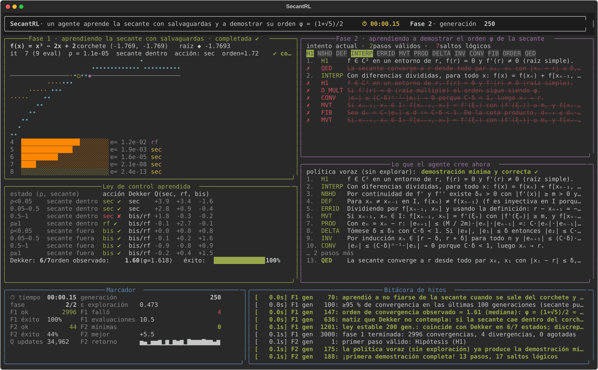

# 05 · SecantRL — método de la secante

**Un agente de Reinforcement Learning aprende, en vivo en la terminal, cuándo fiarse del paso de la secante y cuándo refugiarse en el corchete, y demuestra que el método converge con orden φ = (1 + √5)/2.**

Quinto proyecto de la serie [rl_metodos](../README.md). Recoge los hilos anteriores: la secante es Newton ([proyecto 04](../04_newton/)) con la derivada sustituida por un cociente incremental, el corchete con cambio de signo es la bisección del [proyecto 01](../01_biseccion/) usada como salvaguarda, y en la demostración la forma de Newton del interpolante hace el papel que en 04 hacía el resto de Lagrange del [proyecto 03](../03_taylor/).

```
python -m secantrl
```



## Qué aprende el agente

### Fase 1 · la secante con salvaguardas

El paso de la secante `xₙ₊₁ = xₙ − f(xₙ)(xₙ − xₙ₋₁)/(f(xₙ) − f(xₙ₋₁))` se conoce. Lo que el agente no sabe es **cuándo fiarse de él**. Siempre mantiene un corchete `[lo, hi]` con cambio de signo, y el banco de problemas está lleno de trampas:

| función | qué le pasa a la secante pura |
|---|---|
| `arctan x` con corchete asimétrico `[−0.5, 6]` | la secante por dos puntos lejanos cae fuera del corchete |
| `∛x` | oscila sin converger (f' infinita en la raíz: viola f ∈ C²) |
| `ln x − 1` desde `[0.5, 15]` | el paso cae en `x ≤ 0`, fuera del dominio |
| `x·e^{−x²}` | casi plana lejos de la raíz: dispara puntos muy lejos |
| `eˣ − c` | convexa: desde la derecha se pasa de largo |
| `x⁵ + x/8`, `x⁷ + x/8` | la regula falsi se estanca durante decenas de pasos |
| `x³ − x − 1`, `x³ − 2x + 2`, cúbicas con un par complejo | convergencia limpia: para ver el orden φ |

En este banco la secante pura converge ~69 % de las veces, la regula falsi pura ~63 % (un extremo se estanca y no llega a 10⁻⁹ en 40 pasos) y la bisección siempre, pero con ~32 evaluaciones. El agente observa solo `ρ = |f(xₙ)|/|f(xₙ₋₁)|` (4 cubos) y si el punto que propone la secante **cae dentro del corchete o fuera**, y elige cómo generar el siguiente punto: **secante** (dos últimos puntos), **regula falsi** (extremos del corchete) o **bisección**. Recompensa: `−1` por evaluación `+ log₁₀` de la reducción del **error real** `|x − r|` (shaping basado en potencial; el entorno conoce la raíz, el agente no), `−10` si diverge, fin cuando `|x − r| < 10⁻⁹`.

Lo que emerge es el **método de Dekker** (la base de Brent), comparado estado a estado con la regla de libro:

* la secante cae dentro y el residuo baja → secante: régimen superlineal, y el **orden observado (mediana) ≈ 1.62 = φ**;
* la secante se sale del corchete → volver a él: bisección, o un solo paso de regula falsi;
* y un matiz que Dekker no contempla: si la secante cae dentro, seguirla aunque el residuo apenas baje sale más barato que bisecar, porque bisecar tira el punto actual.

De paso descubre por qué la regula falsi no es un método sino un refugio: un paso por los extremos del corchete es un buen paso de interpolación (es el que usa Brent con el contrapunto); encadenarlos es lineal. El agente converge en ~100 % de los casos con ~10 evaluaciones. El informe marca con «✘ (matiz)» los estados donde discrepa de Dekker, da el orden observado por familia de funciones y mide cuántos pasos de regula falsi van encadenados.

### Fase 2 · demostrar el orden φ

**Teorema.** Sea `f ∈ C²` en un entorno de `r` con `f(r) = 0` y `f'(r) ≠ 0`. Existe `δ > 0` tal que para todo par `x₀ ≠ x₁` con `|xᵢ − r| ≤ δ` la sucesión de la secante converge a `r`, `|xₙ₊₁ − r| ≤ (M/2m)·|xₙ − r|·|xₙ₋₁ − r|` con `m = min|f'|`, `M = max|f''|`, y el orden de convergencia es `φ = (1 + √5)/2 ≈ 1.618`.

Grafo de 13 pasos (hipótesis, entorno seguro, definición, forma de Newton del interpolante con diferencias divididas, identidad del error, valor medio para las diferencias divididas, cota producto, elección de δ, invariante, convergencia, recurrencia de Fibonacci `dₙ₊₁ ≤ dₙ·dₙ₋₁ ⇒ dₙ ≤ d^{Fₙ}`, orden `p² = p + 1`, ∎) más 8 **distractores**: «es Newton con la derivada aproximada, luego cuadrático» (falso: φ < 2), «es un punto fijo `xₙ₊₁ = g(xₙ)`, luego lineal» (falso: depende de dos puntos), «los puntos encierran la raíz, luego `|eₙ| ≤ (b − a)/2ⁿ`» (eso es bisección), «converge desde cualquier par» (falso: ∛x), el non sequitur de Bolzano, «si `f(xₙ) = f(xₙ₋₁)` se repite el punto», «acotada luego convergente» y «con raíz múltiple sigue siendo φ».

## Interfaz en vivo

| panel | qué muestra |
|---|---|
| **Fase 1** | `f` (cian), la secante por los dos últimos puntos (amarillo), el corchete ⟨ ⟩ (azul), la raíz ◆ y los iterados ○● sobre el eje; debajo, el error `|xₙ − r|` en escala log con cómo se generó cada punto (`sec` / `rf` / `bis`) y el orden observado |
| **Ley de control** | los 8 estados con la acción aprendida, la regla de Dekker y ✔/✘, los valores Q y la mediana del orden de convergencia frente a φ |
| **Fase 2 / Lo que el agente cree ahora** | el intento de demostración en curso y la demostración de la política voraz |
| **Marcador / Bitácora** | cronómetro, generación, ε, convergencias, fallos, demostraciones e hitos |

Al terminar guarda `informe.md`, `demostracion.md` e `historia.json` en `runs/<fecha>/`.

## Uso

```bash
cd 05_secante
python -m venv .venv && source .venv/bin/activate
pip install -e ".[dev]"
python -m secantrl              # ~1–2 min con animación
python -m secantrl --speed 3
python -m secantrl --no-tui
pytest -q
```

## Referencias

* Burden y Faires. *Análisis numérico*, §2.3 (secante y regula falsi) y §2.4 (orden de convergencia).
* Dekker, T. J. (1969). *Finding a zero by means of successive linear interpolation.* Brent, R. P. (1973). *Algorithms for Minimization without Derivatives*, cap. 4.
* Stoer y Bulirsch. *Introduction to Numerical Analysis*, §5.9 (orden de la secante vía diferencias divididas).
